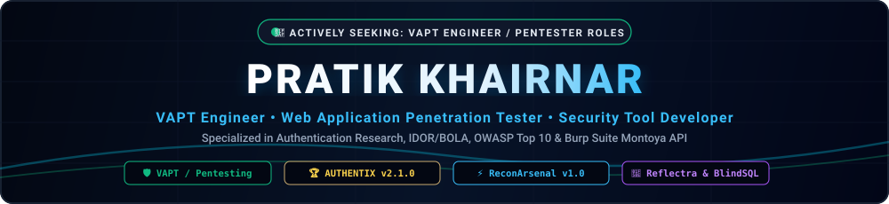
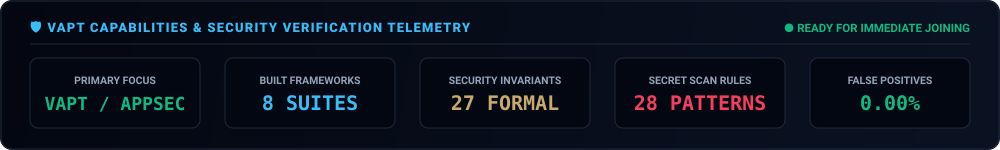

<p align="center">
  
</p>

<p align="center">
  
</p>

<p align="center">
  <a href="mailto:pratik.khairnar.sec@gmail.com"></a>
  <a href="https://pratik-khairnar-sec.github.io/portfolio/"></a>
  <a href="https://pratik-khairnar-sec.github.io/authentix-enterprise/"></a>
  <a href="https://github.com/pratik-khairnar-sec"></a>
</p>

<p align="center">
  <a href="https://linkedin.com/in/pratik-khairnar-sec/"></a>
  <a href="https://x.com/PratikSec"></a>
  <a href="https://pratik-khairnar-sec.medium.com/"></a>
  <a href="https://discord.com/"></a>
  <a href="mailto:pratik.khairnar.sec@gmail.com"></a>
</p>

---

## ⚡ About Me

> [!IMPORTANT]
> ### 🎯 Open to Work — Available for VAPT & Penetration Testing Roles
> - **Target Roles**: **VAPT Engineer**, **Web Application Penetration Tester**, **Junior Security Consultant**, **Application Security (AppSec) Engineer**.
> - **Availability**: Immediate Joining • Fresh Graduate / Entry-Level.
> - **Hands-on Competencies**: Manual web application penetration testing (OWASP Top 10, ASVS), PortSwigger Burp Suite Montoya API extension development, Python security tooling, Digital Forensics & live cybercrime incident investigation.
> - **Interactive Portfolio**: 👉 **[https://pratik-khairnar-sec.github.io/portfolio/](https://pratik-khairnar-sec.github.io/portfolio/)**
> - **Verified Network**: [LinkedIn](https://linkedin.com/in/pratik-khairnar-sec/) • [X / Twitter (@PratikSec)](https://x.com/PratikSec) • [Medium (@pratik-khairnar-sec)](https://pratik-khairnar-sec.medium.com/) • **Discord**: `pratik.khairnar.sec` • [Email](mailto:pratik.khairnar.sec@gmail.com)

I am a **VAPT Engineer**, **Cyber Security Researcher**, and **Security Tool Developer** from India. 

My primary mission is architecting high-velocity, zero-false-positive security verification frameworks that replace noisy, outdated scanners with surgical precision. Every tool I publish features clean architectures, zero unnecessary dependencies, automated Telegram alerting, and dedicated interactive web triage environments.

- 🛡️ **Core Domains**: Web Application Penetration Testing (VAPT), Burp Suite Extension Development (Montoya API), OSINT Attack Surface Discovery, Blind SQLi Detection, Context-Aware XSS Analysis, and Chrome Extension Security Tooling.
- 🎯 **Philosophy**: Strict mathematical baselining, empirical latency calibration, headless browser confirmation, and defensive research.

---

## 🏆 Flagship Enterprise Suite: AUTHENTIX v2.1.0

> **Next-Generation Authentication, IDOR/BOLA & Secret Scanner Security Suite for Burp Suite**
> *(Built on native PortSwigger Montoya API • Java 17/21 • Deterministic Finite-State Automaton)*

<p align="center">
  <a href="https://pratik-khairnar-sec.github.io/authentix-enterprise/" target="_blank">
    
  </a>
</p>

```
       [ Burp Suite HTTP Proxy / Repeater / Scanner / Intruder ]
                                   │
                                   ▼
                       [ TrafficInterpreter.java ]
                 (Actor Attribution & Flow Classification)
                                   │
         ┌─────────────────────────┴─────────────────────────┐
         ▼                                                   ▼
[ FlowGraphEngine.java ]                        [ TokenLifecycleTracker.java ]
(Per-Actor State Machine)                     (SHA-256 Hashes, Shannon Entropy,
                                                Single-Use, Expiration, JWT)
         │                                                   │
         └─────────────────────────┬─────────────────────────┘
                                   ▼
         ┌─────────────────────────┴─────────────────────────┐
         ▼                                                   ▼
[ InvariantEngine.java ]                        [ FileAnalyzerEngine.java ]
 (27 Formal Invariants)                          (28 Secret / Logic Rules)
         │                                                   │
         └─────────────────────────┬─────────────────────────┘
                                   ▼
                      [ AttackPathCorrelator.java ]
               (Chains Findings into 12 Compound ATO Graphs)
                                   │
         ┌─────────────────────────┴─────────────────────────┐
         ▼                                                   ▼
[ Burp Suite Modern UI Tabs ]                       [ Telegram Alerts Push ]
  - Findings & Cross-Actor Matrix                     - Zero UI Latency Async
  - Attack Chains Graph Studio                        - Kali cURL PoC Generator
```

### ⚡ AUTHENTIX Core Highlights:
- 🎯 **Cross-Actor IDOR & BOLA Matrix**: Auto-detects sequential/UUID IDs and maps horizontal & vertical privilege escalation.
- 🛡️ **27 Formal Security Invariants**: Deterministic state machine checks covering OTP replay, session fixation, token entropy, JWT structural flaws, and BFLA.
- 🔬 **28 Deep Secret Analysis Rules**: Scans HTTP streams for JWT secrets, AWS, GCP, Azure, OpenAI, Claude, GitHub, Stripe, Firebase, Telegram, and SendGrid keys.
- ⛓️ **12 Correlated Attack Chain Rules**: Synthesizes compound findings into Account Takeover (ATO) kill-chain graphs.
- 📱 **Telegram Bot Dispatcher**: Mobile alerts with terminal-ready Kali cURL reproduction commands in real time.
- 🏦 **NimbusBank v2 Lab**: 16 banking challenge vectors with automated exploit verification.
- 🌐 **Executive Portal & Reports**: [https://pratik-khairnar-sec.github.io/authentix-enterprise/](https://pratik-khairnar-sec.github.io/authentix-enterprise/)


---

## 🛡️ Complete Security Arsenal Portfolio
*(Automatically synchronized in real time with all active public repositories)*

<!-- START_PORTFOLIO -->
| Framework / Tool | Core Functionality | Version | Category | Interactive Demo | Repository |
|---|---|---|---|---|---|
| **AUTHENTIX Enterprise** | Burp Suite Montoya Security Suite: 27 Invariants, 28 Secret Rules, 12 ATO Chains | `v2.1.0` | 🏆 Flagship | [🌐 Live Demo](https://pratik-khairnar-sec.github.io/authentix-enterprise/) | [`authentix-enterprise`](https://github.com/pratik-khairnar-sec/authentix-enterprise) |
| **Cybersecurity Portfolio & Showcase** | Official Interactive Cybersecurity Portfolio & VAPT Engineer Showcase | `Live` | 🌐 Live Portfolio | [🌐 Live Demo](https://pratik-khairnar-sec.github.io/portfolio/) | [`portfolio`](https://github.com/pratik-khairnar-sec/portfolio) |
| **ReconArsenal** | Unified OSINT & Passive Threat Surface Suite (Wayback CDX, OTX, Passive DNS, Dorks) | `v1.0.0` | ⚡ Core Suite | [🌐 Live Demo](https://pratik-khairnar-sec.github.io/recon-arsenal/) | [`recon-arsenal`](https://github.com/pratik-khairnar-sec/recon-arsenal) |
| **Reflectra** | Context-aware XSS scanner with Headless Chrome verification & DOM-sink analysis | `v7.0.0` | 🛡️ AppSec | [🌐 Live Demo](https://pratik-khairnar-sec.github.io/Reflectra/) | [`Reflectra`](https://github.com/pratik-khairnar-sec/Reflectra) |
| **BlindStrike** | Time-Based & Boolean Blind SQLi framework with baseline latency calibration | `v7.0.0` | 🛡️ AppSec | [🌐 Live Demo](https://pratik-khairnar-sec.github.io/BlindStrike/) | [`BlindStrike`](https://github.com/pratik-khairnar-sec/BlindStrike) |
| **WaybackLens** | High-Performance Wayback Machine CDX Recon & Triage Chrome Extension (Manifest V3) | `v1.0.0` | 🔎 OSINT | [🌐 Live Demo](https://pratik-khairnar-sec.github.io/wayback-lens/) | [`wayback-lens`](https://github.com/pratik-khairnar-sec/wayback-lens) |
| **EndpointFinder** | Autonomous Chrome Extension for deep client-side JS endpoint & parameter extraction | `v1.0.0` | 🔎 Recon | [🌐 Live Demo](https://pratik-khairnar-sec.github.io/endpoint-finder-extension/) | [`endpoint-finder-extension`](https://github.com/pratik-khairnar-sec/endpoint-finder-extension) |
| **ReconForge** | Master Bug Bounty & VAPT Multi-Target Framework with 33 Phases & 13,600+ Dorks | `v3.0.0` | ⚡ Framework | [🌐 Live Demo](https://pratik-khairnar-sec.github.io/ReconForge/) | [`ReconForge`](https://github.com/pratik-khairnar-sec/ReconForge) |
| **CORSair** | Cross-Origin Request Security Analysis & PoC Engine with automated exploitation staging | `v3.0.0` | 🛡️ AppSec | [🌐 Live Demo](https://pratik-khairnar-sec.github.io/CORSair/) | [`CORSair`](https://github.com/pratik-khairnar-sec/CORSair) |
<!-- END_PORTFOLIO -->

---

## 📝 Security Research & Technical Writeups

In-depth technical architecture breakdowns, vulnerability research, and security engineering writeups published on **[Medium (@pratik-khairnar-sec)](https://pratik-khairnar-sec.medium.com/)**:

- 🛡️ **[Inside AUTHENTIX: Building an Automated BOLA & IDOR Detection Engine for Burp Suite using the Montoya API](https://pratik-khairnar-sec.medium.com/)** — Why legacy HTTP proxies fail at access control, deterministic finite-state automation, cross-actor matrix verification, and 27 formal security invariants.
- ⚡ **[Beyond Latency: How Empirical Baseline Calibration Eliminates False Positives in Time-Based Blind SQLi](https://pratik-khairnar-sec.medium.com/)** — Network jitter mitigation, baseline timing calibration, and mathematical validation in BlindStrike v7.0.0.
- 🔬 **[Context-Aware Reflected XSS: Why Regex Scanners Fail and How Headless Verification Fixes It](https://pratik-khairnar-sec.medium.com/)** — Context-escaping heuristics, DOM-sink analysis, and headless Chrome verification in Reflectra.

---

## 📈 Activity & Security Telemetry

<p align="center">
  
</p>

<p align="center">
  
  
</p>

<p align="center">
  
</p>

---

## 🛠️ Technical Competencies & Security Stack

<p align="center">
  
  
  
  
  
  
  
  
</p>

- **Security Disciplines**: Burp Suite Montoya API Extension Architecture, Web Application Pentesting (OWASP Top 10), Time-Based/Boolean Blind SQLi Detection, Cross-Site Scripting (XSS), Cross-Origin Resource Sharing (CORS), Open-Source Intelligence (OSINT).
- **Chrome Extension Security**: Manifest V3 DevTools Protocols, Client-Side JavaScript AST Crawling, Content Script Isolation.
- **Automation & Telemetry**: Multi-threaded concurrency, Telegram Bot API dispatching, Zero-dependency CLI tooling.

---

## 🛡️ Strict Ethical Disclosure Statement

> [!IMPORTANT]
> All software, scripts, and research published under this account are developed strictly for **educational security research**, **authorized penetration testing**, and **defensive vulnerability assessments**. 
> 
> Testing against targets without explicit, prior written authorization from the system owner is strictly prohibited and illegal. As a researcher, I adhere strictly to responsible disclosure practices and ethical security standards.

---

<p align="center">
  <b>Designed &amp; Maintained by Pratik Khairnar</b><br>
  <sub>⚡ Securing Applications • Engineering High-Velocity Defensive Frameworks ⚡</sub>
</p>
